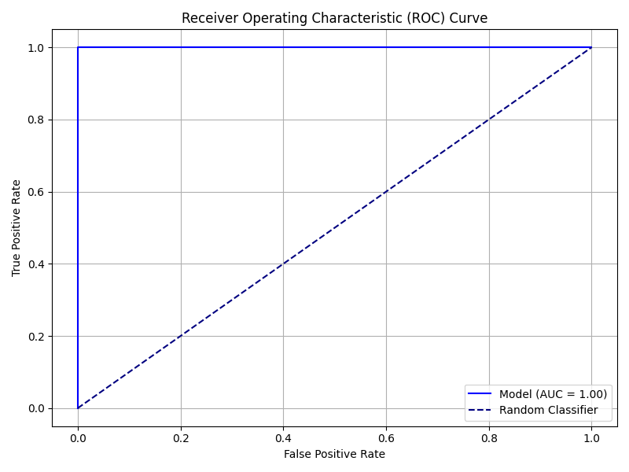
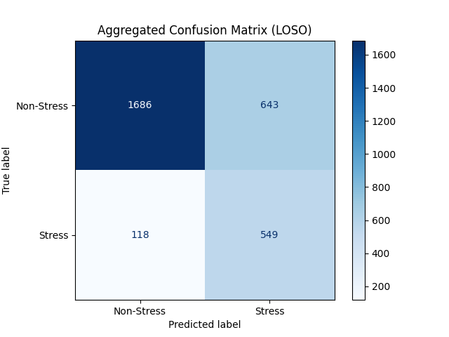

# AI-Powered Stress Detection System
[](https://aihealth-5ysgdhkb4ttrryrbtlovje.streamlit.app/)
**Live Demo:** [Click Here to View Dashboard](https://aihealth-5ysgdhkb4ttrryrbtlovje.streamlit.app/)


This is the backend server and interactive dashboard for the **Multimodal AI Stress Detection System**. It combines physiological data analysis with a Generative AI Health Coach to detect stress and provide personalized recovery advice.

## Features

This system provides a robust, end-to-end solution for stress management:

*   **Multimodal Stress Detection**: Utilizes a **Random Forest** classifier trained on the WESAD dataset (BVP, EDA, HR, TEMP) to accurately predict stress vs. non-stress states.
*   **AI Health Coach**: Integrated **Google Gemini LLM** to provide empathetic, context-aware actionable advice based on real-time physiological metrics.
*   **RAG (Retrieval-Augmented Generation) Memory**: Uses **FAISS** to store and retrieve past user stress summaries, allowing the AI to maintain context over long-term interactions.
*   **Interactive Dashboard**: A **Streamlit** frontend for batch data analysis, manual entry, and visualization of predictions.
*   **Secure API**: **FastAPI** backend that handles model inference, LLM interaction, and feature extraction.

## Local Setup & Development

Follow these steps to run the complete system on your local machine.

### 1. Prerequisites
*   Python 3.8+
*   pip (Python package installer)

### 2. Create a Virtual Environment
It is recommended to use a virtual environment to isolate dependencies.

```bash
# Create a virtual environment
python -m venv .venv

# Activate the virtual environment
# On Windows:
.venv\Scripts\activate
# On macOS/Linux:
source .venv/bin/activate
```

### 3. Install Dependencies
Install all required Python libraries.

```bash
pip install -r requirements.txt
```

### 4. Environment Setup
Create a `.env` file in the root directory to store your API keys.

```bash
# .env
GEMINI_API_KEY=your_google_gemini_api_key_here
```

### 5. Run the Application
You need to run both the backend server and the frontend dashboard.

**Step 1: Start the Backend API**
```bash
uvicorn src.api:app --reload --port 8000
```
*The API will be available at `http://localhost:8000`.*

**Step 2: Start the Dashboard**
Open a new terminal and run:
```bash
streamlit run src/dashboard.py
```
*The dashboard will open in your browser at `http://localhost:8501`.*

## Deployment to Render & Streamlit Cloud

This project is designed for easy cloud deployment.

### Step 1: Deploy Backend to Railway
1.  Push your code to **GitHub**.
2.  Login to [Railway](https://railway.app) and create a **New Project** -> **Deploy from GitHub repo**.
3.  Select your repository (`Ai_Health`).
4.  Railway will automatically detect the `Procfile` and `nixpacks.toml` configuration files.
5.  **Environment Variables**:
    *   Go to the "Variables" tab.
    *   Add `GEMINI_API_KEY` with your actual API key.
6.  The deployment will start automatically.

### Step 2: Deploy Frontend to Streamlit Cloud
1.  Deploy your `src/dashboard.py` file on Streamlit Cloud.
2.  **Environment Variables**:
    *   `API_URL`: The URL of your Railway backend (e.g., `https://web-production-xxxx.up.railway.app`).

## 📂 Project Structure

A clean, professional structure organized for scalability:

-   `src/`: **Core Application Code**. Contains the FastAPI backend (`api.py`) and Streamlit dashboard (`dashboard.py`).
-   `assets/`: **Project Visuals**. Stores images for documentation (ROC curves, confusion matrices).
-   `scripts/`: **Utility Scripts**. Standalone scripts for testing or specific one-off tasks.
-   `models/`: (Local Only) Directory for trained `.joblib` models (excluded from Git for size).
-   `data/`: (Local Only) Directory for datasets and CSV files (excluded from Git).

## API Endpoints Overview

*   `GET /`: Health check to verify the API is running.
*   `POST /predict`: Upload a CSV file for batch stress prediction and summary advice.
*   `POST /predict_manual`: Submit manual physiological metrics (HR, EDA, BVP) for a single prediction and instant tips.
*   `POST /chat`: Interactive chat endpoint to talk with the AI Health Coach, with RAG memory context.

## Model Performance & Visuals

The system's Random Forest model has been rigorously evaluated using Leave-One-Subject-Out (LOSO) cross-validation to ensure generalizability.

### Receiver Operating Characteristic (ROC) Curve
Demonstrates the trade-off between sensitivity and specificity.


### Confusion Matrix
Shows the model's accuracy in distinguishing between "Stress" and "Non-Stress" states.

